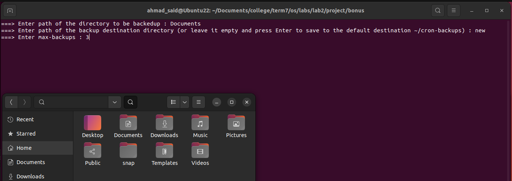
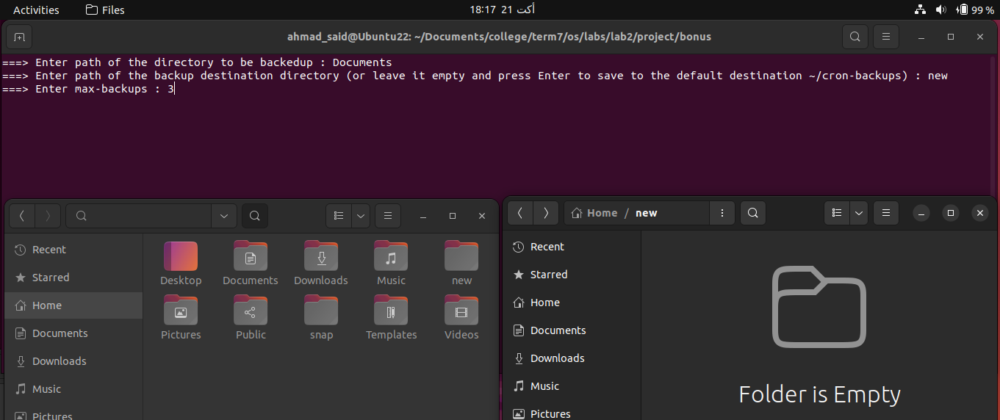

# Backup-Cron Script

## Made by:

- Ahmad Said Nouh
  - ID: 7086

## Contents:

- [Backup-Cron Script](#backup-cron-script)
  - [Made by:](#made-by)
  - [Contents:](#contents)
  - [User Manual](#user-manual)
    - [Starting the program](#starting-the-program)
    - [Enter inputs](#enter-inputs)
    - [How to enter directory path](#how-to-enter-directory-path)
  - [Code Overview](#code-overview)
    - [Makefile overview](#makefile-overview)
    - [Backup-cron script overview](#backup-cron-script-overview) 
  - [Cron expression of 3rd friday of a month](#cron-expression-of-3rd-friday-of-a-month)
  - [Sample Runs](#sample-runs)
  - [Input Validations and Errors Handling](#input-validations-and-errors-handling)

## User Manual

### Starting the program

First run ___sudo apt install cron___ command if it's not installed on your machine. Then run ___sudo apt install make___ command if ___make___ command is not installed on your machine. Then, open the directory named ___bonus___ in a terminal. Then just run ___make___ command. That's it...  

### Enter inputs

Once you run ___make___ command, the program will ask you to enter the four inputs as shown in the image below. 

- First input ___dir___ : it is the directory to be backed up, must be existing directory.
- Second input ___backupdir___ : it is the backup destination directory. You have two options here, you either specify its name or just leave this option empty and the program will automatically backup to a default directory ___~/cron-backups___.Therefore, there are 6 cases:
  - cases1: default directory ___~/cron-backups___ and it's not exiting ==============> will create it then proceed backing up directly. 
  - cases2: default directory ___~/cron-backups___ and it's exiting but empty ========> will proceed backing up directly. 					
  - cases3: default directory ___~/cron-backups___ and it's exiting but not empty ====> will firstly ask the user if he want to delete all existing files in __~/cron-backups__. If user said yes, the program will delete all existing files then proceed backing up directly. If user said no, the program will terminate execution without any deletion. 
  - cases4: user specified directory and it's not existing ======================> will create it then proceed backing up directly. 	
  - cases5: user specified directory and it's existing but empty ================> will proceed backing up directly. 						
  - cases6: user specified directory and it's existing but not empty ============> will display error message and then terminate execution without any deletion. 
- Third input ___max-backups___ : it is the maximum number of backups to be stored in the ___backupdir___. If maximum backups is reached and a new backup needs to be added, the program will delete the oldest backup and then add the new one.
  
### How to enter directory path
All directories that will be dealt with must be below your home directory. Therefore, any directory path you will enter to the program must be relative to the (\~/). The tilde (\~) is a Linux "shortcut" to denote a user's home directory. Thus tilde slash (\~/) is the beginning of a path to a file or directory below the your home directory. For example, if you have a directory named ___abc___ below your home directory then its path is ___~/abc___. So if you want to back it up then just enter to the program ___abc___ , not ___~/abc___. Also, if you have a directory named ___xyz___ below that ___abc___ directory then its path is ___~/abc/xyz___. So, if you want to back it up then just enter to the program ___abc/xyz___ , not ___~/abc/xyz___. 

## Code Overview

### Makefile overview
First, inputs are taken from the user. Then, inputs are validated and the appropriate message is shown if an error occurs. If no errors, inputs will be analysed to know whether destination directory will be the default directory or will be a user specified directory. Then, the destination directory will be parsed to determined which of the six cases described previously will be executed. Also, at this step, the file checks if the destination directory is not existing, the file will create it. Then, the first backup is created and then the cron job is installed in the crontab. The job of the cron job is to run the script with the entered arguments every minute to check if a new backup is needed or not.

### Backup-cron script overview
First, arguments are parsed. Then, the script checks whether changes have occured and a new backup is needed or not and then takes the appropriate action and then terminates.

## Cron expression of 3rd friday of a month
The cron expression if I need to run this backup every 3rd Friday of the month at 12:31 am is (__31 0 15-21 * 5__).

## Sample Runs
__Backing up to the default directory__ :

  
__Backing up to a non-existing user specified directory__ :

  
__Backing up to an existing but empty user specified directory__ :

## Input Validations and Errors Handling

__Empty inputs__ :

  
__Source directory not existing__ :

  
__Empty max-backups__ :

  
__Zero max-backups__ :

  
__Non integer max-backups__ :

  
__Backing directory to itself__ :

  
__Default directory not empty answer no__ :

  
__Default directory not empty answer yes__ :

  
__User specified destination directory not empty__ :

